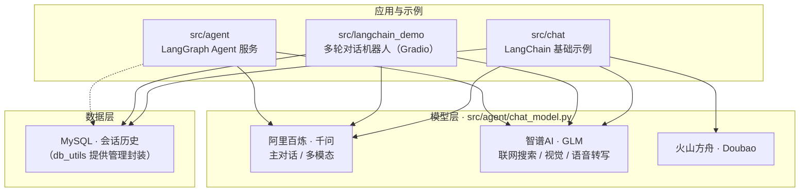
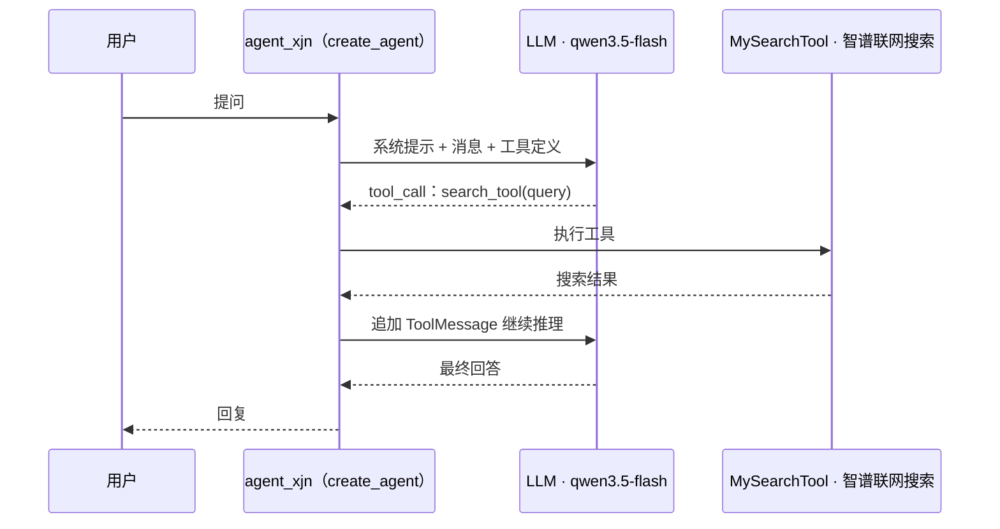
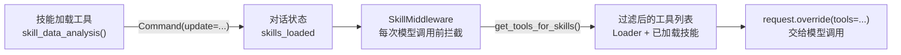

# PythonLangchain

基于 **LangChain 1.x / LangGraph 1.x** 的 LLM Agent 学习与实践项目，由 LangGraph Agent 模板工程改造而来。

项目包含三部分：

- **`src/agent`** —— 注册到 LangGraph 的 Agent 服务（`agent_xjn`），演示自定义工具、中间件、多模型接入；
- **`src/langchain_demo`** —— 从内存会话到 Gradio Web、语音多模态的多轮对话机器人系列迭代；
- **`src/chat`** —— LangChain 基础能力示例（流式输出、结构化输出、语音等）。

## 技术栈

| 类别 | 技术 |
| --- | --- |
| 语言 / 运行时 | Python ≥ 3.12 |
| Agent 框架 | LangChain 1.2、LangGraph 1.0、langgraph-cli |
| 模型接入 | 阿里百炼（千问）、智谱AI（GLM / 联网搜索 / 语音转写）、火山方舟（Doubao）、硅基流动 |
| 数据 | SQLAlchemy + PyMySQL（MySQL 会话历史）、`utils/db_utils.py` 管理封装 |
| 界面 | Gradio 5 |
| 其他 | Pydantic、loguru、pandas / numpy / matplotlib、pdfplumber、soundfile |

## 项目架构



### Agent 执行流程

`langgraph.json` 注册的入口是 `src/agent/agent2.py:agent_xjn`，基于 `create_agent` 构建的标准 ReAct 工具调用循环：



## 目录结构

```
PythonLangchain/
├── langgraph.json              # LangGraph 服务器配置：注册 agent 图入口
├── pyproject.toml              # 项目元数据、依赖与 ruff/mypy 配置
├── requirements.txt            # 完整运行依赖
├── .env                        # API Key 等环境变量（已在 .gitignore 中）
├── test.py                     # 独立小工具：JSON 字符串解析函数
└── src/
    ├── agent/                  # ★ 核心 Agent 服务
    │   ├── agent2.py           #   LangGraph 注册入口：联网搜索 Agent
    │   ├── agent1.py           #   示例：邮件助手 Agent
    │   ├── chat_model.py       #   统一模型客户端（千问 / GLM / 火山方舟等）
    │   ├── custom_chat_model.py#   自定义 ChatModel（继承 BaseChatOpenAI）
    │   ├── env_utils.py        #   .env 环境变量加载
    │   ├── tools/              #   Agent 工具集
    │   ├── middleware_collection/  # Agent 中间件
    │   ├── core/               #   技能状态与工具过滤核心逻辑
    │   └── utils/              #   数据库 / 日志工具
    ├── chat/                   # LangChain 基础用法示例
    ├── langchain_demo/         # 多轮对话机器人迭代示例
    └── test                    # MemoryBear 平台导出的工作流配置（YAML）
```

## 模块说明

### src/agent —— 核心 Agent 服务

| 文件 | 说明 |
| --- | --- |
| `agent2.py` | **注册入口**：`create_agent(model=llm, tools=[MySearchTool()])`，即 `agent_xjn`，可联网搜索的通用助手 |
| `agent1.py` | 邮件助手示例（`send_email` 工具，发送逻辑为 TODO） |
| `chat_model.py` | 统一模型客户端：主对话模型（百炼 qwen3.5-flash）、`llm_light`（GLM）、`llm_vision`（GLM 视觉）、`llm_omni`（千问 Omni），以及智谱 / 火山方舟 / 硅基流动客户端 |
| `custom_chat_model.py` | 自定义 ChatModel：继承 `BaseChatOpenAI` 直连百炼，演示消息转换与手工调用流程 |
| `env_utils.py` | 读取 `.env` 并导出各平台 API Key / Base URL |
| `tools/my_search.py` | 联网搜索工具（`BaseTool` 子类写法，底层调智谱 `search_pro`） |
| `tools/web_search.py` | 联网搜索工具（`@tool` 装饰器写法，能力同上） |
| `tools/digit_calculate.py` | `calculate` 四则运算工具 |
| `tools/data_analysis.py` | 「技能」机制演示：加载器工具（`skill_*`，通过 `Command` 更新 `skills_loaded` 状态）+ 数据分析 / 文本处理技能工具 |
| `middleware_collection/skill_middleware.py` | `SkillMiddleware`：每次模型调用前按 `skills_loaded` 动态过滤工具（仿 Claude Skills 思路） |
| `middleware_collection/logging_middleware.py` | `LoggingMiddleware`：打印每次模型调用的工具与状态 |
| `core/skill_map.py` | 技能名 → 工具列表映射，`get_tools_for_skills()` 过滤逻辑 |
| `core/state_utils.py` | `SkillState`：在 `MessagesState` 基础上增加 `skills_loaded` 字段（累计 reducer） |
| `utils/db_utils.py` | `MySQLDatabaseManager`：MySQL 连接与表信息查询封装 |
| `utils/log_utils.py` | 基于 loguru 的日志封装 |

「技能」动态工具过滤机制的设计思路：



> 说明：`SkillMiddleware` / `LoggingMiddleware` / `SkillState` 已实现但尚未接入入口 Agent。接入方式示意（LangChain 1.x）：
>
> ```python
> from langchain.agents import create_agent
>
> agent_xjn = create_agent(
>     model=llm,
>     tools=ALL_TOOLS,
>     middleware=[SkillMiddleware(), LoggingMiddleware()],
>     state_schema=SkillState,
> )
> ```

### src/chat —— LangChain 基础示例

| 文件 | 说明 |
| --- | --- |
| `chat.py` | 最基础的模型调用（`llm.invoke`） |
| `chat_stream.py` | 流式输出，提取 reasoning 思考内容 |
| `chat_printf.py` | `with_structured_output` + Pydantic 结构化输出（电影信息抽取） |
| `chat_printf2.py` | Prompt → LLM → SimpleJsonOutputParser 链式调用 |
| `chat_audio.py` | 智谱 `glm-asr` 语音转文字 |
| `chat_audio_full.py` | 千问 Omni 模型流式生成「文本 + 语音」 |
| `chat_audio_omni.py` | Qwen-Omni 多模态对话 + MySQL 会话历史 |
| `chat_volcano.py` | 火山方舟 Ark / AsyncArk SDK 调用示例 |
| `systemmodel_test.py` | 内部模型服务（sys_client）流式调用测试 |
| `chat_tool.py` | 空文件（预留） |

### src/langchain_demo —— 多轮对话机器人迭代

按开发顺序排列，逐步叠加能力：

| 文件 | 说明 |
| --- | --- |
| `multimodal_robot.py` | 起步版：内存会话历史 + `RunnableWithMessageHistory` 多轮对话 |
| `multimodel_robot_data.py` | 会话历史持久化到 MySQL（`SQLChatMessageHistory`） |
| `multimodal_robot_summary.py` | 引入对话历史摘要：保留最近 2 条，更早内容压缩为一条摘要 |
| `multimodal_robot_data_summary.py` | 摘要结果动态注入系统提示词 |
| `multimodel_robot_web.py` | 接入 Gradio Web 界面（带摘要） |
| `multimodal_robot_final.py` | 综合版：Gradio + MySQL 持久化 + 摘要压缩 |
| `multimodal_robot_audio.py` | 支持语音输入（智谱 ASR） |
| `multimodal_robot_audio_full.py` | 最新完成版：语音 + 图像多模态输入 |

## 快速开始

### 1. 安装依赖

需要 Python ≥ 3.12，推荐用 [uv](https://docs.astral.sh/uv/) 管理虚拟环境与依赖：

```bash
# 安装 uv（已安装可跳过）
brew install uv                                    # macOS / Linux（Homebrew）
# 或使用官方脚本：curl -LsSf https://astral.sh/uv/install.sh | sh

# 创建并激活虚拟环境（uv 会自动下载缺失的 Python 3.12）
uv venv --python 3.12
source .venv/bin/activate        # Windows: .venv\Scripts\activate

# 安装依赖（uv pip 作用于当前激活的虚拟环境）
uv pip install -r requirements.txt  # 全部运行依赖
uv pip install -e .                 # 可编辑安装本项目，提供 agent 包
```

不使用 uv 时，标准库 venv + pip 的等价写法：

```bash
python3.12 -m venv .venv
source .venv/bin/activate
pip install -r requirements.txt
pip install -e .
```

### 2. 配置环境变量

在项目根目录创建 `.env`（模板如下，实际 Key 请自行申请），完整变量见 [env_utils.py](src/agent/env_utils.py)：

```bash
# 阿里百炼（DashScope）—— 主对话模型
QWEN_API_KEY=sk-xxxx
QWEN_BASE_URL=https://dashscope.aliyuncs.com/compatible-mode/v1

# 智谱AI —— 联网搜索、GLM 文本/视觉、语音转写
ZHIPU_API_KEY=xxxx
ZHIPUAI_BASE_URL=https://open.bigmodel.cn/api/paas/v4

# 火山方舟（可选）
VOLCANO_API_KEY=xxxx
VOLCANO_BASE_URL=https://ark.cn-beijing.volces.com/api/v3

# 硅基流动（可选）
SILICON_FLOW_API_KEY=sk-xxxx
SILICON_FLOW_BASE_URL=https://api.siliconflow.cn/v1

# LangSmith 链路追踪（可选）
LANGSMITH_API_KEY=xxxx
```

### 3. 启动 Agent 服务

`langgraph dev` 会读取 `langgraph.json`，启动本地开发服务器并打开 LangGraph Studio（默认 http://127.0.0.1:2024），可在界面中直接调试 `agent` 图：

```bash
langgraph dev
```

### 4. 运行其他示例

```bash
python src/chat/chat.py
python src/langchain_demo/multimodal_robot_final.py
```

## 已知注意事项

1. **硬编码凭据**：`src/agent/chat_model.py` 的 `sys_client` 中有内网服务地址与 API Key；多个 demo（`chat_audio_omni.py`、`langchain_demo/*`）中把 MySQL 连接串（含密码）写死在代码里。建议统一迁移到 `.env` 并轮换泄漏的凭据。
2. **本地绝对路径**：`src/chat/chat_audio.py` 引用了本机音频文件路径，运行前需替换为自己的音频。
3. **未接入的中间件**：Skill / 日志中间件与 `SkillState` 已实现但未挂到入口 Agent，接入方式见上文。
4. **实验代码较多**：`chat_model.py`、`agent2.py` 中保留了多个注释掉的模型配置备选方案，可按需启用。
5. `src/chat/chat_tool.py` 为空文件（预留）。
6. `src/test` 为 MemoryBear 平台导出的工作流 YAML，与 Python 代码相互独立。

## 许可证

MIT（见 [pyproject.toml](pyproject.toml)）。作者：TimeBomb2018。
